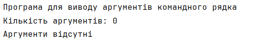

# Завдання 1 (24.03.2025)

## Мета
Ознайомитися з базовими принципами роботи з Java, аргументами командного рядка та системою контролю версій GIT.

## Умови завдання

1. Підготувати сховище для розміщення проєкту (локальне або на GitHub).
2. Написати просту консольну програму, яка:
    - Виводить заголовок програми.
    - Визначає кількість аргументів командного рядка.
    - Виводить їх у нумерованому списку, якщо вони є.
3. Прикріпити посилання на GIT-репозиторій та архівований проєкт.

## Опис реалізації

Програма написана мовою Java. Основний клас `Main` знаходиться в пакеті `task1`.  
Функціонал:
- Обробка аргументів, переданих через командний рядок.
- Виведення кількості аргументів.
- Виведення кожного аргументу в окремому рядку з його порядковим номером.

## Результат виконання

**Команда запуску:**
