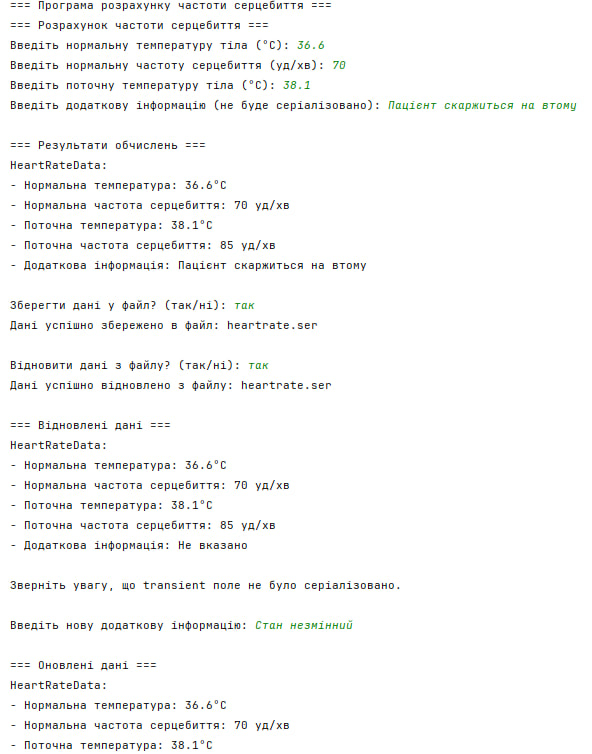
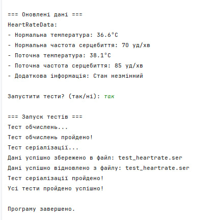

# Завдання 2 (25.03.2025)

## Мета
Розробити серіалізований Java-клас для збереження та обробки даних, що моделюють зміну частоти серцебиття залежно від температури тіла. Реалізувати серіалізацію/десеріалізацію, transient-поля, javadoc-документацію, діалоговий інтерфейс та модульне тестування.

## Умови завдання

1. Створити серіалізований клас `HeartRateData`, що містить:
    - вхідні параметри: нормальна температура, нормальна частота, поточна температура;
    - обчислену поточну частоту серцебиття;
    - transient-поле для демонстрації особливостей серіалізації.

2. Реалізувати клас `HeartRateCalculator`, що агрегує об’єкт `HeartRateData` та виконує:
    - збереження об’єкта в файл (серіалізація);
    - відновлення з файлу (десеріалізація).

3. Створити клас `HeartRateDemo` з діалоговим інтерфейсом:
    - введення даних;
    - вивід результату;
    - демонстрація збереження та відновлення об’єкта;
    - демонстрація того, що transient-поле не серіалізується.

4. Реалізувати клас `HeartRateTest`, що перевіряє:
    - правильність обчислення;
    - коректність серіалізації/десеріалізації.

5. Індивідуальне завдання: розрахунок частоти серцебиття при підвищенні температури на 1 градус = +10 ударів/хв.

## Приклад роботи програми

**Введені дані:**
- Нормальна температура: 36.6 °C
- Нормальна частота серцебиття: 70 уд/хв
- Поточна температура: 38.1 °C
- Додаткова інформація: «Пацієнт скаржиться на втому»

**Результат обчислення:**
 