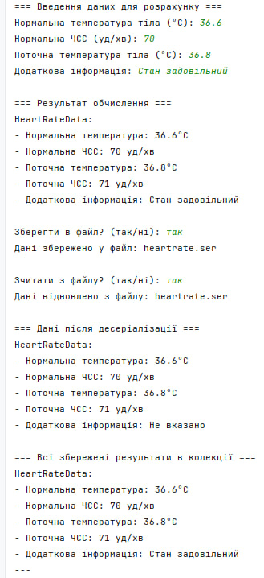

# Завдання 3 (26.03.2025)

## Мета

Реалізувати Java-програму, яка зберігає результати обчислення частоти серцебиття залежно від температури тіла з використанням серіалізації, колекцій та шаблону проєктування **Factory Method**. Програма повинна дозволяти збереження та відновлення об’єктів, виведення результатів у текстовому форматі, демонстрацію роботи `transient`-полів, та легко розширюватись новими типами виводу.

---

## Умови завдання

1. **Основу** становить код попередньої лабораторної роботи, який розширюється наступним чином:
2. Зберігання результатів у **колекції** `List<HeartRateData>` із можливістю **серіалізації/десеріалізації**.
3. Реалізація шаблону **Factory Method**:
    - Ієрархія виводу, яка дозволяє легко додавати нові типи відображення результатів (наприклад, графічне, HTML тощо).
4. Створення інтерфейсу **"фабрикованих" об'єктів** з методом `display(HeartRateData data)`:
    - Реалізація `TextDisplay`, що виводить результат у консоль у зручному форматі.
5. Реалізація інтерфейсу фабрики `DisplayFactory`, який створює об’єкти типу `Displayable`.
6. **Transient-поле** (`additionalInfo`) у класі `HeartRateData`, яке не серіалізується.
---

## Ключові компоненти

- **`HeartRateData`** – серіалізований клас, що містить вхідні параметри, обчислену ЧСС та transient-поле.
- **`HeartRateCalculator`** – клас для серіалізації/десеріалізації об'єкта.
- **`Displayable`** – інтерфейс для відображення результатів.
- **`TextDisplay`** – реалізація виводу у текстовому вигляді.
- **`DisplayFactory` / `TextDisplayFactory`** – фабричний інтерфейс та конкретна реалізація фабрики.
- **`Main3`** – консольний інтерфейс користувача, який:
    - приймає введення,
    - обчислює ЧСС,
    - дозволяє зберігати та зчитувати дані,
    - демонструє результати,
    - виводить колекцію з усіма збереженими результатами.

---

## Приклад виконання

**Введені дані:**

