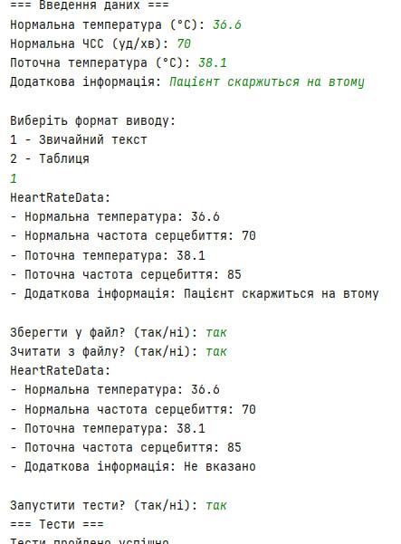
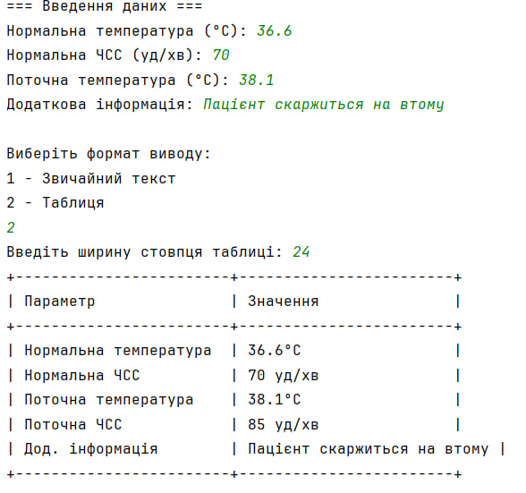

# Завдання 4 (27.03.2025)

## Мета
Використовуючи шаблон проєктування **Factory Method**, розширити ієрархію для виводу результатів моделювання частоти серцебиття залежно від температури тіла. Продемонструвати **перевизначення**, **перевантаження**, **поліморфізм**, реалізувати **серіалізацію об'єктів**, **діалоговий інтерфейс** та **модульне тестування**.

---

## Умови завдання

1. За основу використовувати вихідний текст проекту попередньої лабораторної роботи Використовуючи шаблон проектування Factory Method (Virtual Constructor), розширити ієрархію похідними класами, реалізують методи для подання результатів у вигляді текстової
таблиці. Параметри відображення таблиці мають визначатися користувачем.
2. Продемонструвати заміщення (перевизначення, overriding), поєднання (перевантаження, overloading), динамічне призначення методів (Пізнє зв'язування, поліморфізм, dynamic method dispatch).
3. Забезпечити діалоговий інтерфейс із користувачем.
4. Розробити клас для тестування основної функціональності.
5. Використати коментарі для автоматичної генерації документації засобами javadoc.
---

## Приклад роботи програми

**Введені дані:**
- Нормальна температура: 36.6 °C
- Нормальна частота серцебиття: 70 уд/хв
- Поточна температура: 38.1 °C
- Додаткова інформація: «Пацієнт скаржиться на втому»

**Результат (таблиця, ширина 24):**

