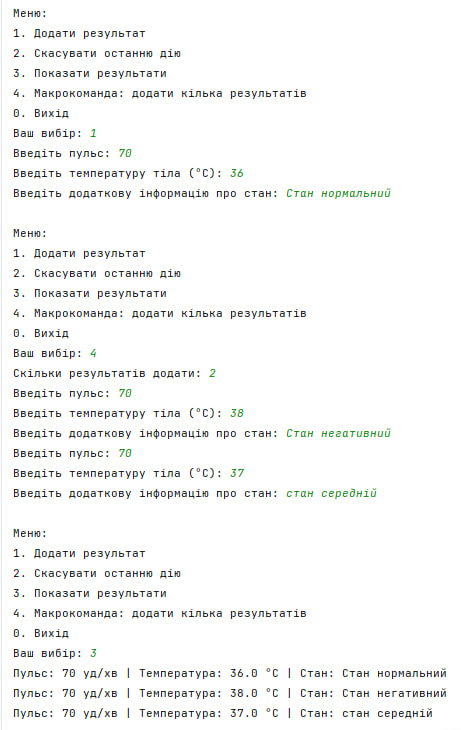
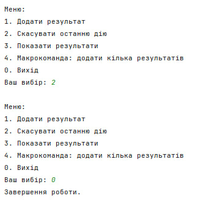

# Завдання 5 (28.03.2025)

## Мета
Реалізувати можливість скасування (undo) операцій за допомогою шаблону **Command**, продемонструвати використання **макрокоманд**, застосувати шаблон **Singleton** для обробки результатів здоров'я, створити діалоговий інтерфейс для користувача та розробити клас для тестування функціональності програми.

---

## Умови завдання

1. Реалізувати можливість скасування (undo) операцій (команд).
2. Продемонструвати поняття "макрокоманда"
3. При розробці програми використовувати шаблон Singletone.
4. Забезпечити діалоговий інтерфейс із користувачем.
5. Розробити клас для тестування функціональності програми.
---

## Приклад роботи програми

**Меню користувача:**

