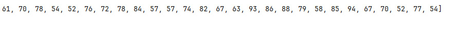

# Завдання 6 (31.03.2025)

## Мета
Демонстрація можливості паралельної обробки елементів колекції (пошук мінімуму, максимуму, обчислення середнього значення, відбір за критерієм, статистична обробка тощо), а також управління чергою завдань (команд) за допомогою шаблону **Worker Thread**.

---

## Умови завдання

1. Продемонструвати можливість паралельної обробки елементів колекції (пошук мінімуму, максимуму, обчислення середнього значення, відбір за критерієм, статистична обробка тощо).
2. Управління чергою завдань (команд) реалізувати за допомогою шаблону Worker Thread.

---

## Приклад роботи програми

Програма генерує випадкові числа та виконує над ними наступні операції:

1. **Пошук мінімального значення**.
2. **Пошук максимального значення**.
3. **Обчислення середнього значення**.
4. **Статистична обробка**: кількість, сума, середнє, мінімум, максимум.

**Виведення програми** 

