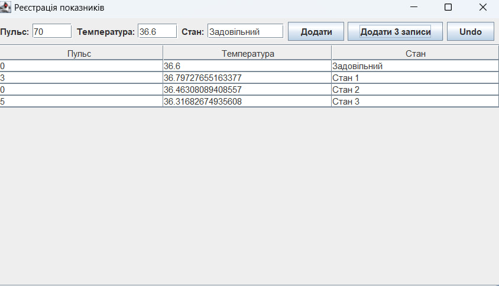

# Завдання 7 

## Мета
Розробити та реалізувати **графічний інтерфейс користувача (GUI)** для попередніх завдань із використанням шаблону **Command** та реалізацією **макрокоманд** і **історії команд (Undo)**.

---

## Умови завдання

1. **Створити графічний інтерфейс**:
    
---

## Основні функції

- **Додати** — додає один запис на основі введених даних.
- **Додати 3 записи** — створює та додає три випадкових результати за допомогою макрокоманди.
- **Undo** — скасовує останню дію (додавання результату чи макрокоманди).

---

## Графічний інтерфейс

Інтерфейс включає:
- Поля для введення:
    - Пульс (ціле число)
    - Температура (дійсне число)
    - Стан (рядок)
- Кнопки:
    - `Додати`
    - `Додати 3 записи`
    - `Undo`
- Таблиця для відображення усіх результатів.

---

## Приклад використання

1. Користувач вводить пульс, температуру та стан, натискає **«Додати»**.
2. Дані додаються до списку та відображаються у таблиці.
3. Користувач може натиснути **«Додати 3 записи»** — програма згенерує три випадкових записи.
4. Натискання кнопки **«Undo»** скасовує останню дію — як одну команду, так і макрокоманду.

---

## Структура проєкту

